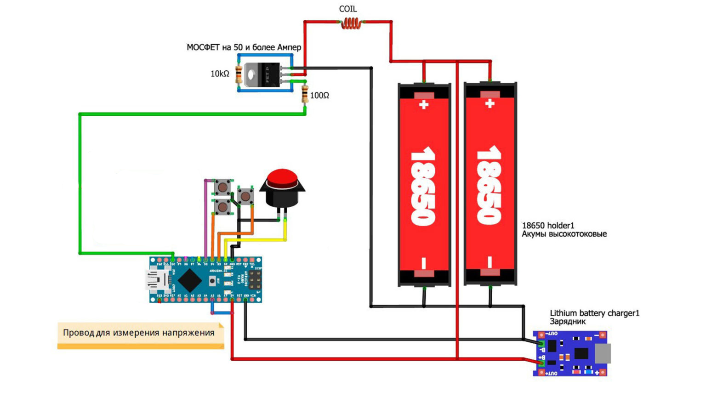
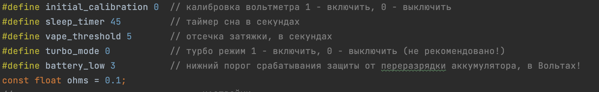
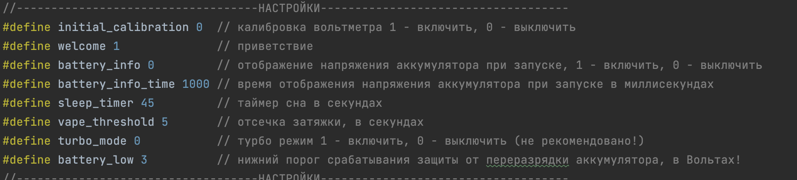
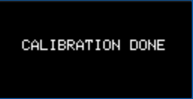
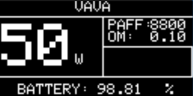
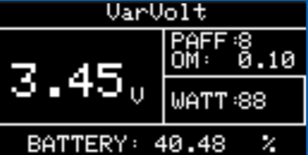
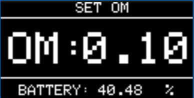

# NahalOS v0.4.2β 💢

Агрессивная ОС для самодельного боксмода `NaVal`.

### Дисклеймер💀

Внимание!  
Я ни в коем случае не пропагандирую парение и все остальное, что вас убьет. Если вы собрали "все по схеме", а дудка загорелась, подорвалась или спровоцировала ядерный взрыв, то я не виноват!

Интерфейс ругается и обзывается! Закройте уши беременным детям и животным с расстройствами    

**_Пожалуйста, поставьте звёздочку если вам понравилось. Для вас это просто HTML-элемент, а нам приятно!_**

### Комплектующие🔌
• Arduino Nano👾  
• Две китайские банки 18650🔋🔋  
• Резисторы на 100 и 10К ОМ🪄  
• Транзистор >= 50А🪄   
• 510 коннектор (куда без него)💨   
• Держалка аккумов➿   
• Дисплей SSD1306🖥   
• Плата зарядки🔌   
• Китайские провода🌀   
• Руки из плеч (или чудо)🤷  

## Обновление v0.4.2BETA🔄
 
✅ **Слегка изменили экран LOW BATTERY, потому что потому.**  

✅️ **Убрали анимацию выключения, уж слишком убогая**

✅️ **Убрали мистические делэи (реально, откуда🤷‍)**

✅️ **Теперь можно [настроить](https://github.com/ruthenium-44/NahalOS#настройки-1) время отображения инфо о батарее при включении**

✅️ **Переписали то, что натворил Copilot🥲**

❌ **Не вязали узлы из проводов**

# Документация

## Версия без дисплея

Эта версия не имеет дисплея, и урезана в функционале.
Также есть изменения в навигации:
* Доступен только режим вариватт, где изменения производятся нажатиями кнопок UP и DOWN, 
добавляющие/убирающие по 10Вт.
* Навигация происходит в слепую, т.к. дисплей отсутствует. (Ватты регулируйте по вкусу ¯\_(ツ)_/¯ )
* Приветственный экран отсутствует, вместо него сразу запускается режим вариватт.
* Хранение тяг остается, но как их достать - неизвестно.🤷‍
* Убраны лишние настройки
* Кнопка SET вам больше не нужна.

#### Схема

#### Сборка
Паяем все по схеме и пихаем в лаконичный корпус. Закрываем ноутбук, готовим чашечку кофе,
выходим на балкон... И идем обратно, т.к. не прочитали инструкцию.

#### Инструкция
1. После сборки, подключите банки к зарядке, и зарядите их до 4.2В.
2. Подключите все это дело к компьютеру, и загрузите прошивку.
3. После загрузки проведите калибровку. Для этого:

*Клик*

1. Подготовить вольтметр
2. Убедиться, что #define initial_calibration 1 стоит единичка (16 строка кода прошивки)
3. Нажать “Загрузить”, дождаться появления надписи “Загрузка завершена”
4. Открыть монитор порта (правый верхний угол, иконка лупы), дождаться появления строки с real vcc
5. Измерить напряжение на пинах 5V и GND
6. Ввести напряжение в порт В МИЛЛИВОЛЬТАХ. Т.е. если вольтметр показывает 4.67, то ввести 4670.
7. Нажать кнопку “Отправить” или нажать Enter на клавиатуре
8. Дождаться строку с результатом расчёта константы
9. Вернуться к 16 строке прошивки, изменить #define initial_calibration 0
10. Снова загрузить прошивку в Arduino

После калибровки учимся пользоваться устройством.

| Кнопка |                                            Что делает                                            |
|--------|:------------------------------------------------------------------------------------------------:|
| FIRE   | Нажать 5 раз: Включится Удержание: Парение Нажать 3 раза: Сон Двойное нажатие: TURBO |
| SET    |                                               🤷‍                                                |
| UP     |                                              +10Вт                                               |
| DOWN   |                                              -10Вт                                               |

Простите за подробность, объяснил чайникам.

#### Настройки

В начале скетча есть настройки, которые можно менять под себя. Но вообще, не трогайте их, если не знаете, что делаете.
А вот и они:

* **initial_calibration**, если нужно калибровать, 0 если нет. После калибровки, ставьте 0.
Калибровка описана выше, в инструкции.
* **sleep_timer** Таймер сна. По умолчанию 45 секунд.
* **vape_threshold** Таймер отсечки. Стоит 5 секунд, чтобы ничего не сгорело. Если вы бессмертный, то можете поставить больше.
* **turbo_mode** Турбо режим. Честно говоря, даже я не уверен как это работает. Но если нажать FIRE дважды, мосфет подаст максимальный ток на коил (жалко его). По умолчанию выключен.
* **battery_low** Порог низкого заряда батареи. Прямо в конец, когда она выключится. По умолчанию 3V на всякий случай.
* **const float ohms = XXX** Внимание! Поставьте здесь сопротивление койла.

***
## Версия с дисплеем SSD1306

Это версия с дисплеем и кучей менюшек с интерфейсом для каждой.

#### Схема

Подключение дисплея к Arduino:

| Arduino | Дисплей |
|---------|---------|
| 5V      | VIN     |
| GND     | GND     |
| A4      | SDA     |
| A5      | SCL     |

#### Инструкция
1. После сборки, подключите банки к зарядке, и зарядите их.
2. Подключите все это дело к компьютеру, и загрузите прошивку.
3. После загрузки проведите калибровку. Для этого:

*Клик*

1. Подготовить вольтметр
2. Убедиться, что #define initial_calibration 1 стоит единичка (16 строка кода прошивки)
3. Нажать “Загрузить”, дождаться появления надписи “Загрузка завершена”
4. Открыть монитор порта (правый верхний угол, иконка лупы), дождаться появления строки с real vcc
5. Измерить напряжение на пинах 5V и GND
6. Ввести напряжение в порт В МИЛЛИВОЛЬТАХ. Т.е. если вольтметр показывает 4.67, то ввести 4670.
7. Нажать кнопку “Отправить” или нажать Enter на клавиатуре
8. Дождаться строку с результатом расчёта константы
9. Вернуться к 16 строке прошивки, изменить #define initial_calibration 0
10. Снова загрузить прошивку в Arduino

4. Обязательно установите сопротивление! Иначе вы можете сгореть.
Делается это нажатием SET до режима "SET OM", и потом нажатием UP/DOWN до нужного значения.

После калибровки учимся пользоваться устройством.

| Кнопка |                                              Что делает                                               |
|--------|:-----------------------------------------------------------------------------------------------------:|
| FIRE   | Нажать 5 раз: Включится Удержание: Парение Нажать 3 раза: Сон Двойное нажатие: TURBO  |
| SET    |         Удержание: Показать инфу об аккумуляторах Нажатие: Переключение режимов по кругу          |
| UP     |                Вариватт: +1Вт Варивольт +0.01В Установка сопротивления: +0.05Ω                |
| DOWN   |                Вариватт: -1Вт Варивольт -0.01В Установка сопротивления: -0.05Ω                |

#### Настройки
В начале скетча есть настройки, которые можно менять под себя. Но вообще, не трогайте их, если не знаете, что делаете.
А вот и они:

* **initial_calibration**, если нужно калибровать, 0 если нет. После калибровки, ставьте 0.
  Калибровка описана выше.
* **welcome** Отображает приветствие при включении.
* **battery_info** Отображает информацию о батареях при включении.
* **battery_info_time** Время, которое будет отображаться информация о батареях.
* **sleep_timer** Таймер сна. По умолчанию 45 секунд.
* **vape_threshold** Таймер отсечки. Стоит 5 секунд, чтобы ничего не сгорело. Если вы бессмертный, то можете поставить больше.
* **turbo_mode** Турбо режим. Честно говоря, даже я не уверен как это работает. Но если нажать FIRE дважды, мосфет подаст максимальный ток на коил (жалко его). По умолчанию выключен.
* **battery_low** Порог низкого заряда батареи. Прямо в конец, когда она выключится. По умолчанию 3V на всякий случай.
>Сопротивление устанавливается через режим OM SET

### Режимы
Тут перечислим режимы работы устройства. Их всего 3 и они переключаются по кругу. Переключение происходит нажатием кнопки SET.

#### ВариВольт
Режим установки напряжения. Изменяется по 0.05В. Максимум ограничен текущим напряжением батареи. За это спасибо дяде Гайверу.
>Важно отметить для тех, кто все переделает: В скетче везде где volts там милливольты.

На экране отображается также кол-во тяг (они же PAFF), заряд батареи, сопротивление (которое вы, надеюсь, установили) и значение в ваттах.

#### ВариВатт
Лично для меня основной режим. Мощность меняется по 1Вт.  
На экране отображается также кол-во тяг (они же PAFF), заряд батареи, сопротивление (которое вы, надеюсь, установили) и значение в вольтах.

#### Режим установки сопротивления
Все, это последний раз, когда я вас попрошу установить сопротивление) Кнопками UP и DOWN, естественно.

Ниже экраны, которые вы увидите при эксплуатации устройства.

#### Экраны

Для разблокировки нужно 5 раз нажать кнопку FIRE. Это сопровождается включением дисплея:

После включения (если в настройках не выключено) показывается доброе приветствие:

А может и не включится. Если видите это:

  
то нужно снова прошить с initial_calibration = 0.

Если battery_info = 1, то отобразится:

И наконец главное меню:

Меняем режимы кнопкой SET.

Если сядет батарея:

И если сработала отсечка:

При выключении:

***
